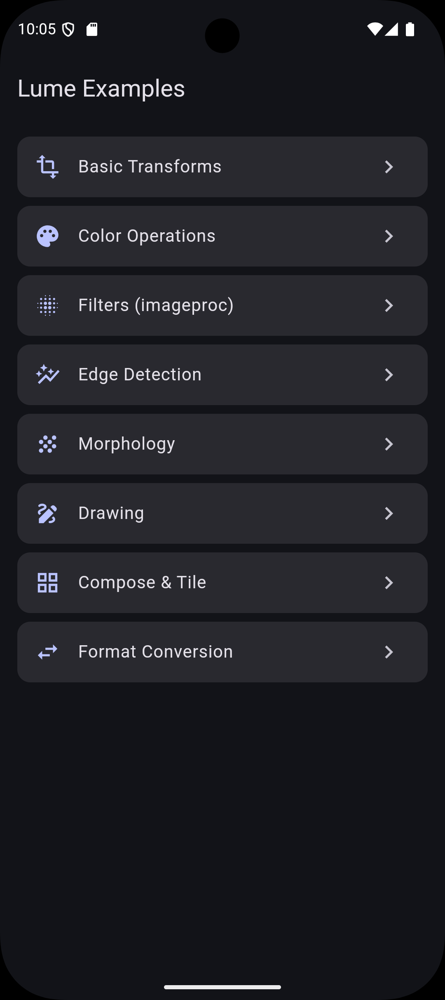
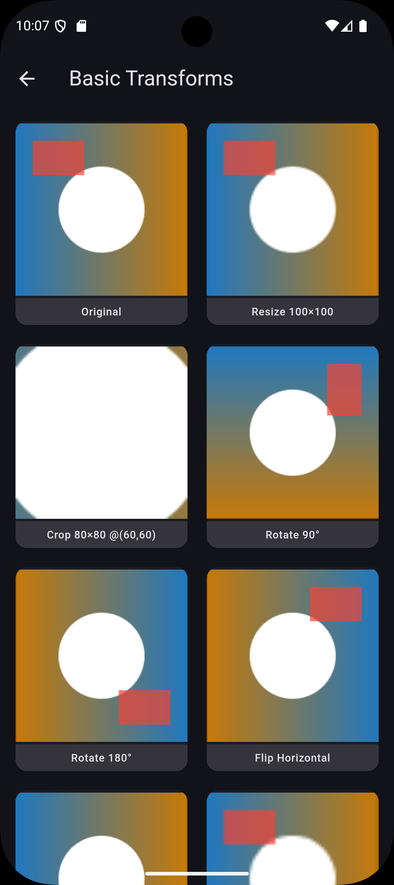
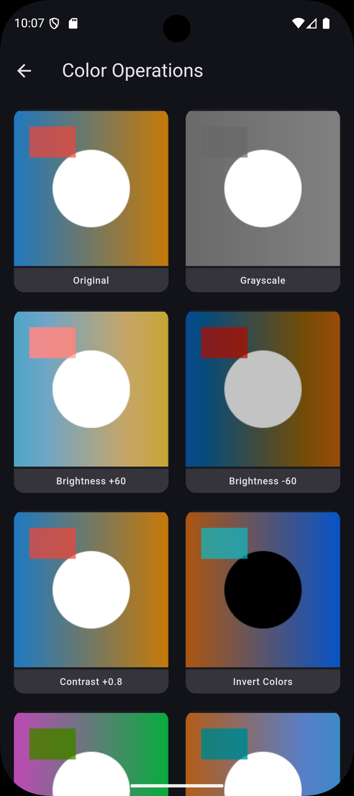
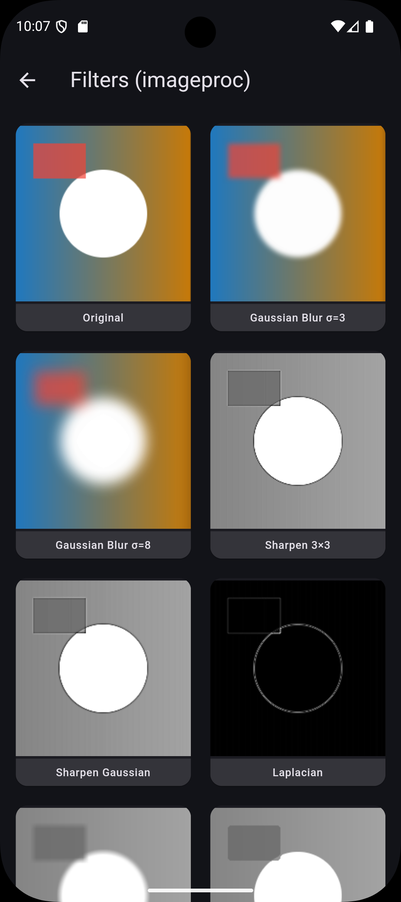
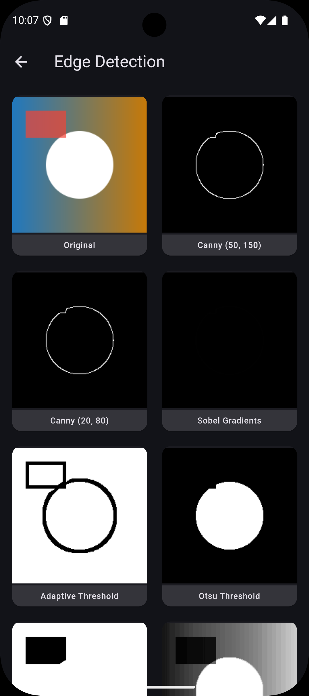
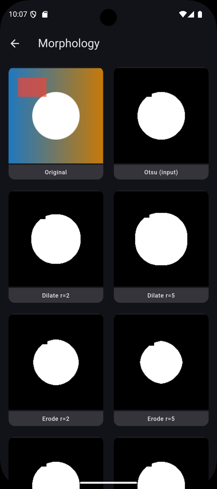
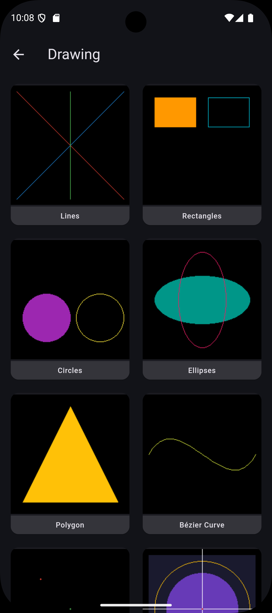
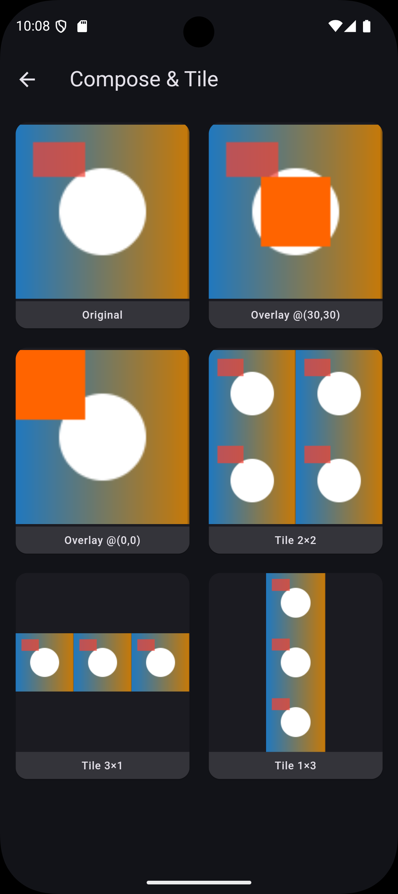
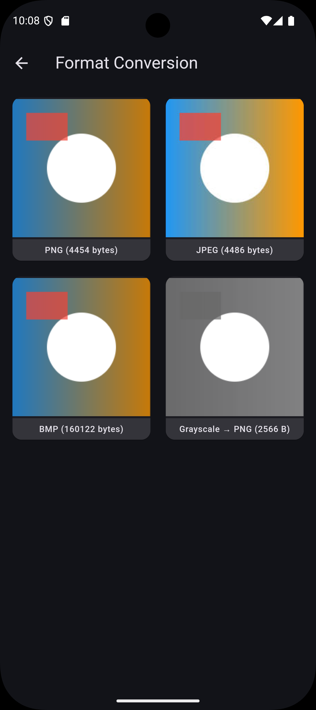

# Lume

High-performance image manipulation for Flutter, powered by Rust.

Lume provides a fluent, chainable API for image processing through Rust's [`image`](https://crates.io/crates/image) and [`imageproc`](https://crates.io/crates/imageproc) libraries via Flutter Rust Bridge.

## Overview

Two main interfaces:

- **`LumeImage`** — Basic operations: resize, crop, rotate, color adjustments, format conversion.
- **`LumeCanvas`** — Advanced processing: edge detection, filters, morphology, computer vision, drawing.

```dart
import 'package:lume/lume.dart';

// Basic: load, resize, convert to grayscale
final img = LumeImage.fromFile(file)
  .resize(width: 800, height: 600)
  .grayscale()
  .toPng();

// Advanced: Canny edge detection + drawing
final processed = LumeCanvas(img)
  .canny(low: 50, high: 150)
  .drawFilledCircle(cx: 100, cy: 100, radius: 30, color: Colors.red)
  .toLumeImage();

// Use in Flutter widgets
LumeImageWidget(image: processed, fit: BoxFit.cover);
```

## Installation

Add to `pubspec.yaml`:

```yaml
dependencies:
  lume:
    path: ./lume # or from pub.dev when published
```

Run:

```bash
flutter pub get
```

## LumeImage — Basic Operations

### Factories

| Method                                         | Description                                    |
| ---------------------------------------------- | ---------------------------------------------- |
| `LumeImage.fromBytes(Uint8List bytes)`         | From raw encoded bytes (PNG, JPEG, WebP, etc.) |
| `LumeImage.fromFile(File file)`                | From file (sync)                               |
| `LumeImage.fromFileAsync(File file)`           | From file (async)                              |
| `LumeImage.fromPath(String path)`              | From path string (sync)                        |
| `LumeImage.fromPathAsync(String path)`         | From path string (async)                       |
| `LumeImage.fromAsset(String assetPath)`        | From Flutter asset                             |
| `LumeImage.blank({width, height, r, g, b, a})` | Create blank image                             |
| `LumeImage.from(LumeImage other)`              | Copy constructor                               |

### Accessors

```dart
Uint8List bytes = img.bytes;    // Raw encoded bytes
int width = img.width;          // Image width
int height = img.height;        // Image height
String format = img.format;     // Format (png, jpeg, etc.)
int size = img.sizeBytes;       // Size in bytes
LumeImageInfo info = img.info;  // Full metadata
```

### Transform Operations

```dart
// Resize
img.resize(width: 800, height: 600, keepAspectRatio: true);
img.resizeWithFilter(width: 800, height: 600, filter: 'lanczos3');
img.thumbnail(maxWidth: 300, maxHeight: 300);
img.thumbnailExact(width: 200, height: 200);

// Crop
img.crop(x: 100, y: 100, width: 400, height: 400);

// Rotate & Flip
img.rotate(degrees: 90);   // 90, 180, 270
img.flipHorizontal();
img.flipVertical();

// Compose
img.overlay(otherImage, x: 50, y: 50);
img.tile(cols: 3, rows: 2);
```

### Color Operations

```dart
img.grayscale();
img.adjustBrightness(30);      // Positive = brighter
img.adjustContrast(0.5);       // >0 = more contrast
img.blur(sigma: 2.0);
img.sharpen(sigma: 1.0, threshold: 10);
img.invertColors();
img.hueRotate(degrees: 45);
```

### Format Conversion

```dart
img.convertFormat('png');
img.toPng();
img.toJpeg();
img.toWebp();
```

### Persistence

```dart
// Async
await img.writeToFile(file);
await img.saveTo('/path/to/output.png');

// Sync
img.writeToFileSync(file);
img.saveToSync('/path/to/output.png');
```

## LumeCanvas — Advanced Processing

### Filters

```dart
LumeCanvas(img)
  .gaussianBlur(sigma: 2.0)
  .medianFilter(xRadius: 2, yRadius: 2)
  .bilateralFilter(windowSize: 5, sigmaColor: 10.0, sigmaSpatial: 10.0)
  .boxFilter(xRadius: 3, yRadius: 3)
  .sharpen3x3()
  .sharpenGaussian(sigma: 1.0, amount: 2.0)
  .laplacianFilter()
  .toLumeImage();
```

### Edge Detection

```dart
LumeCanvas(img)
  .canny(low: 50, high: 150)      // Canny edge detector
  .sobelGradients()                // Sobel gradients
  .toLumeImage();
```

### Contrast & Threshold

```dart
LumeCanvas(img)
  .adaptiveThreshold(blockRadius: 5)
  .otsuThreshold()
  .threshold(value: 128, invert: false)
  .equalizeHistogram()
  .stretchContrast(
    inputLower: 50,
    inputUpper: 200,
    outputLower: 0,
    outputUpper: 255,
  )
  .toLumeImage();
```

### Morphology

```dart
LumeCanvas(img)
  .dilate(radius: 2)               // Expand white regions
  .erode(radius: 2)                // Shrink white regions
  .morphologicalOpen(radius: 3)    // Erode then dilate
  .morphologicalClose(radius: 3)   // Dilate then erode
  .toLumeImage();
```

### Geometric Transformations

```dart
LumeCanvas(img)
  .rotateAboutCenter(theta: 0.5, backgroundColor: Colors.black)
  .translate(tx: 50, ty: -30)
  .toLumeImage();
```

### Noise

```dart
LumeCanvas(img)
  .gaussianNoise(mean: 0.0, stddev: 20.0, seed: BigInt.from(42))
  .saltAndPepperNoise(rate: 0.05, seed: BigInt.from(123))
  .toLumeImage();
```

### Seam Carving

```dart
// Content-aware width reduction
LumeCanvas(img).seamCarveWidth(newWidth: 400).toLumeImage();
```

### Drawing

```dart
LumeCanvas(img)
  // Lines
  .drawLine(x1: 0, y1: 0, x2: 100, y2: 100, color: Colors.red)
  .drawAntialiasedLine(x1: 0, y1: 0, x2: 100, y2: 100, color: Colors.blue)

  // Rectangles
  .drawHollowRect(x: 10, y: 10, width: 100, height: 50, color: Colors.green)
  .drawFilledRect(x: 10, y: 10, width: 100, height: 50, color: Colors.yellow)

  // Circles
  .drawHollowCircle(cx: 100, cy: 100, radius: 50, color: Colors.purple)
  .drawFilledCircle(cx: 100, cy: 100, radius: 50, color: Colors.orange)

  // Ellipses
  .drawHollowEllipse(cx: 100, cy: 100, widthRadius: 80, heightRadius: 40, color: Colors.cyan)
  .drawFilledEllipse(cx: 100, cy: 100, widthRadius: 80, heightRadius: 40, color: Colors.pink)

  // Polygons
  .drawFilledPolygon(points: [(0, 0), (100, 0), (50, 100)], color: Colors.teal)
  .drawHollowPolygon(points: [(0, 0), (100, 0), (50, 100)], color: Colors.indigo)

  // Curves
  .drawCubicBezier(
    startX: 0, startY: 0,
    endX: 200, endY: 200,
    ctrl1X: 50, ctrl1Y: 100,
    ctrl2X: 150, ctrl2Y: 50,
    color: Colors.brown,
  )

  // Markers
  .drawCross(cx: 100, cy: 100, color: Colors.white)

  .toLumeImage();
```

### Computer Vision / Analysis

```dart
// Find contours
List<LumeContour> contours = LumeCanvas(binaryImg).findContours();

// Distance transform
LumeImage distance = LumeCanvas(img).distanceTransform().toLumeImage();
```

## Flutter Integration

### LumeImageProvider

Use `LumeImage` with any Flutter widget that accepts an `ImageProvider`:

```dart
Image(image: LumeImageProvider(myLumeImage));
DecorationImage(image: LumeImageProvider(myLumeImage), fit: BoxFit.cover);
CircleAvatar(backgroundImage: LumeImageProvider(myLumeImage));
```

### LumeImageWidget

Convenience widget with common `Image` parameters:

```dart
LumeImageWidget(
  image: myLumeImage,
  fit: BoxFit.cover,
  width: 300,
  height: 200,
);
```

## Chainable API

Both `LumeImage` and `LumeCanvas` are immutable — each operation returns a new instance:

```dart
// Branch pipelines freely
final original = LumeImage.fromFile(file);

final small = original.thumbnail(maxWidth: 100, maxHeight: 100);
final grayscale = original.grayscale();
final edges = LumeCanvas(original).canny(low: 50, high: 150).toLumeImage();

// Original is unchanged
```

## Example Showcase

The example app demonstrates all operations with visual before/after comparisons:

|                                    Gallery                                     |                                 Basic Transforms                                  |                                     Color Operations                                      |
| :----------------------------------------------------------------------------: | :-------------------------------------------------------------------------------: | :---------------------------------------------------------------------------------------: |
| <br>_Main menu with all demos_ | <br>_Resize, crop, rotate, flip_ | <br>_Grayscale, brightness, contrast_ |

|                                Filters (imageproc)                                |                                 Edge Detection                                 |                                  Morphology                                   |
| :-------------------------------------------------------------------------------: | :----------------------------------------------------------------------------: | :---------------------------------------------------------------------------: |
| <br>_Gaussian blur, sharpen, laplacian_ | <br>_Canny, sobel, threshold_ | <br>_Dilate, erode, open, close_ |

|                              Drawing Primitives                               |                               Compose & Tile                                |                            Format Conversion                            |
| :---------------------------------------------------------------------------: | :-------------------------------------------------------------------------: | :---------------------------------------------------------------------: |
| <br>_Lines, circles, rects, bézier_ | <br>_Overlay and tile operations_ | <br>_PNG, JPEG, BMP sizes_ |

To run the example:

```bash
cd example
flutter pub get
flutter run
```

## Technical Details

- **Rust libraries**: `image` 0.25, `imageproc` 0.25
- **Bridge**: Flutter Rust Bridge 2.11.1
- **Data transfer**: `Uint8List` / `Vec<u8>` — zero-copy where possible
- **Sync operations**: Most operations are synchronous for better performance
- **Formats supported**: PNG, JPEG, GIF, WebP, BMP, TIFF, ICO

## License

MIT
