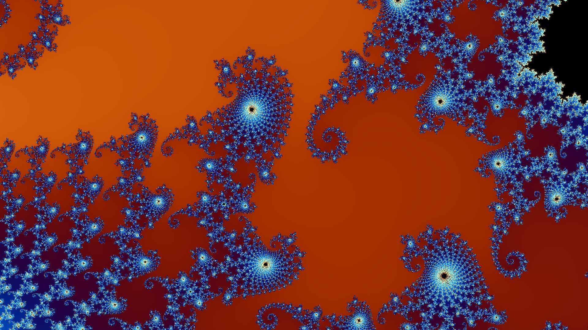
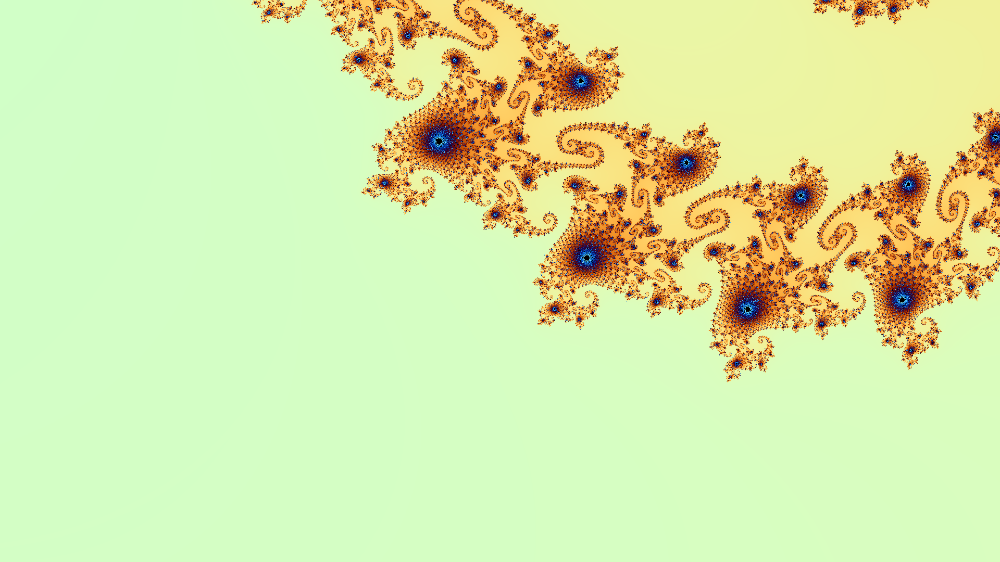
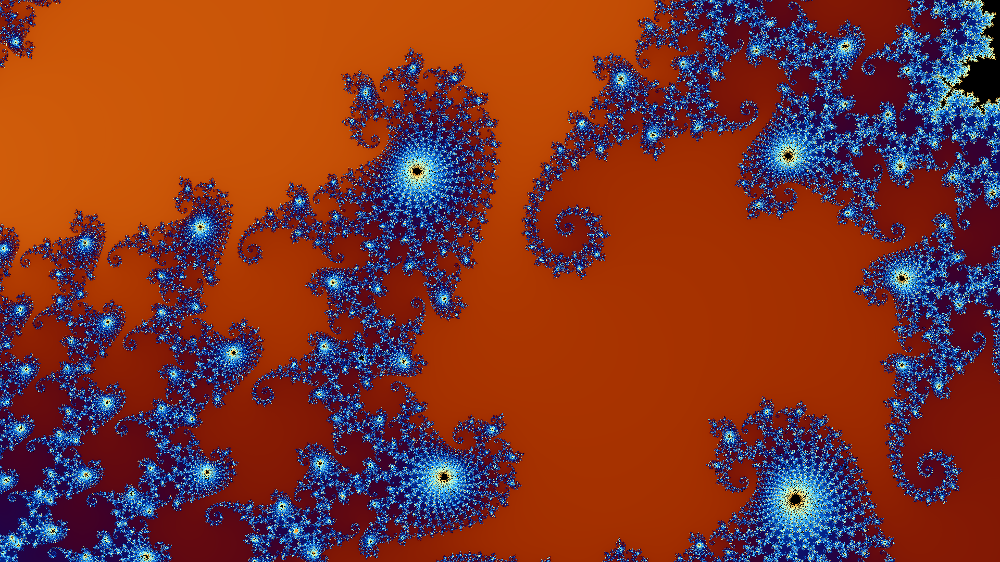

# Mandelbrot + Lume

A Flutter demo app showcasing real-time Mandelbrot fractal rendering with GLSL fragment shaders and image processing using the [Lume](../lume) library.


_Seahorse Valley — Deep zoom with exponential coloring_

## Features

### 🎨 Visual Demos

1. **GLSL Shader Puro** — Real-time Mandelbrot rendering
   - Infinite cyclic zoom through 6 interesting fractal points
   - Exponential zoom with automatic iteration increase (200→1000)
   - Smooth fade transitions between locations
   - Color palette shifts per point
   - Save high-res screenshots (1920×1080)

2. **GLSL + Lume Processing** — Shader capture with Rust-powered filters
   - Same infinite zoom fractal viewer
   - 6 Lume filters to apply:
     - Grayscale + Contrast
     - Edge Detection (Canny)
     - Sharpen + Invert
     - Gaussian Blur
     - Sobel Gradients
     - Otsu Threshold
   - Save both shader and processed results

### 🎯 Interesting Fractal Points

| #   | Location        | Coordinates       | Feature               |
| --- | --------------- | ----------------- | --------------------- |
| 1   | Seahorse Valley | (-0.7453, 0.1127) | Classic spirals       |
| 2   | Elephant Valley | (-0.1011, 0.9563) | Trunk-like structures |
| 3   | Antenna Tip     | (-1.2500, 0.0000) | Needle point          |
| 4   | Mini Mandelbrot | (-0.7463, 0.1102) | Self-similarity       |
| 5   | Cusp            | (0.2501, 0.0000)  | Main cardioid edge    |
| 6   | Spiral Arm      | (-0.1624, 1.0340) | Complex spirals       |

Each cycle lasts 18 seconds with 1.5s fade transitions.

## Example Screenshots

Captured during infinite zoom cycles:

|                         Zoom Level                         |                           Detail                           |
| :--------------------------------------------------------: | :--------------------------------------------------------: |
|  |  |
|                     Early zoom (~50x)                      |                     Deep zoom (~500x)                      |
|  |                                                            |
|                   Maximum zoom (~2000x)                    |

_Note: Images saved to `screenshots/` folder with timestamp_

## Technical Details

- **Shader**: GLSL ES 3.2 fragment shader with smooth iteration coloring
- **Precision**: Float32 (limited by GPU fragment shaders)
- **Zoom Strategy**: Cyclic reset with fade to overcome float precision limits
- **Processing**: Flutter Rust Bridge + imageproc crate via Lume
- **Output**: 600×600 capture → Lume processing → display

## Running

```bash
cd mandelbrot
flutter pub get
flutter run -d linux
```

## Screenshots

Saved images are stored in `./screenshots/`:

- `mandelbrot_<timestamp>.png` — Demo 1 shader output
- `mandelbrot_shader_<timestamp>.png` — Demo 2 shader output
- `mandelbrot_lume_<timestamp>.png` — Lume processed result

## Dependencies

- [Lume](../lume) — Rust-powered image processing
- `flutter_shaders` — Fragment shader support
- `dart:ui` — CustomPaint and PictureRecorder
